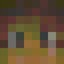

# Crafatar [](https://travis-ci.org/crafatar/crafatar/) [](https://coveralls.io/r/crafatar/crafatar) [](https://codeclimate.com/github/crafatar/crafatar)
[](http://webchat.esper.net/?channels=crafatar) [](https://david-dm.org/crafatar/crafatar) [](https://david-dm.org/crafatar/crafatar#info=devDependencies) [](http://inch-ci.org/github/crafatar/crafatar)



[Crafatar](https://crafatar.com) serves Minecraft avatars based on the skin for use in external applications.
Inspired by [Gravatar](https://gravatar.com) (hence the name) and [Minotar](https://minotar.net).

Image manipulation is done by [lwip](https://github.com/EyalAr/lwip). 3D renders are created with [node-canvas](https://github.com/Automattic/node-canvas), based on math by [confuser](https://github.com/confuser/serverless-mc-skin-viewer).

# Contributions welcome!

There are usually a few [open issues](https://github.com/crafatar/crafatar/issues).  
We welcome any opinions or advice in discussions as well as pull requests.  
Issues tagged with [](https://github.com/crafatar/crafatar/labels/help%20wanted) show where we could especially need your help!

# Examples

| | | | |
| :---: | :---: | :---: | :---: |
|  |  |  |  |  |
|  |  |  |  |  |
|  |  |  |  |  |
|  |  |  |  |  |

## Usage / Documentation

Please [visit the website](https://crafatar.com) for details.

## Contact

* You can [follow](https://twitter.com/crafatar) us on twitter
* Open an [issue](https://github.com/crafatar/crafatar/issues/) on GitHub
* You can [join IRC](https://webchat.esper.net/?channels=crafatar) in #crafatar on irc.esper.net.

## Installation on Heroku
[](https://heroku.com/deploy)

## Installation on Dokku
##### [dokku server]
Install the [dokku-redis](https://github.com/ohardy/dokku-redis#redis-plugin-for-dokku) plugin.
```shell
dokku redis:start
dokku apps:create crafatar
dokku config:set crafatar BIND=0.0.0.0 PORT=5000
```
For persistent images and logs:
```shell
dokku docker-options:add crafatar deploy "-v /var/lib/crafatar/images:/app/images"
dokku docker-options:add crafatar deploy "-v /var/log/crafatar:/app/logs"
```
If you want to listen on extra domains:
```shell
dokku domains crafatar:add example.com
```
##### [your machine]
Add dokku remote and deploy!
```shell
git remote add dokku dokku@example.com:crafatar
git push dokku master
```

## Installation on your machine
* Use io.js
* [Install](https://github.com/Automattic/node-canvas/wiki) Cairo.
* `npm install`
* Start `redis-server`
* `npm start`
* Access [http://localhost:3000](http://localhost:3000)


## Tests
```shell
npm test
```

If you want to debug failing tests:
```shell
# show logs during tests
env VERBOSE_TEST=true npm test
```

It can be helpful to monitor redis commands to debug caching errors:
```shell
redis-cli monitor
```